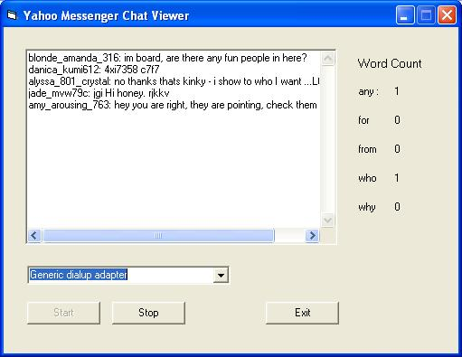



## Winpcap packet sniffer tutorial \+ example

### Description

This will show you how to to capture network packets using winpcap. No network programming or tcp/ip knowledge is required. The example program captures chat from a yahoo messenger chat room and places in a text box. I tried to make the example program very simple. I used vbpcap.dll functions library so we don't have to do low level winpcap programming. The tutorial explains everything of the example program and also shows how to analyze packets. I also included a way to sequential search a string for multiple substrings(very fast). This will be useful if you want to search for some particular string or bytes in your packet.
 
### More Info
 

             |
---                |---
**Submitted On**   |2006-01-10 06:54:40
**By**             |[Mohaimen Hossain](https://github.com/Planet-Source-Code/PSCIndex/blob/master/ByAuthor/mohaimen-hossain.md)
**Level**          |Beginner
**User Rating**    |4.8 (19 globes from 4 users)
**Compatibility**  |VB 6\.0
**Category**       |[Internet/ HTML](https://github.com/Planet-Source-Code/PSCIndex/blob/master/ByCategory/internet-html__1-34.md)
**World**          |[Visual Basic](https://github.com/Planet-Source-Code/PSCIndex/blob/master/ByWorld/visual-basic.md)
**Archive File**   |[Winpcap\_pa196392192006\.zip](https://github.com/Planet-Source-Code/mohaimen-hossain-winpcap-packet-sniffer-tutorial-example__1-63993/archive/master.zip)

